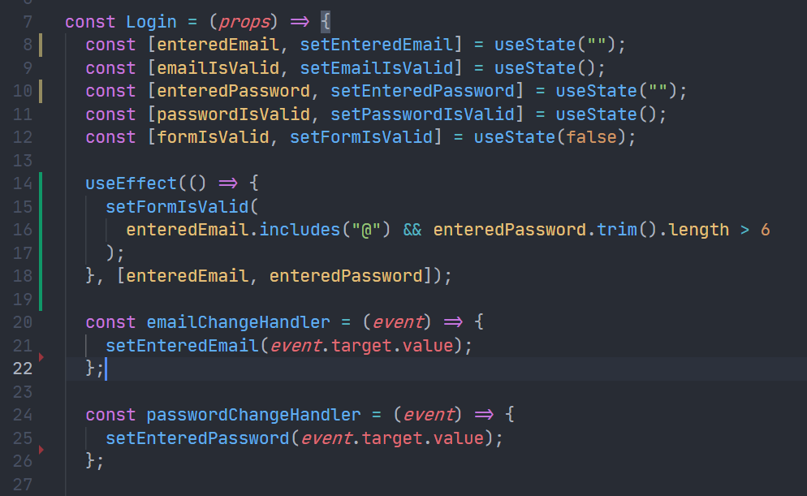

# Effects, Reducers & Context

- Working with (Side) Effects
- Managing more complex state with Reducers
- Managing App-Wide or Component-Wide State with Context

## React Main Job

- Render UI & React to User Input
  - Evaluate & render JSX
  - Manage State & Props
  - React to (User) Events & Input
  - Re-evaluate Component upon State & Prop Changes
  - This is all "baked into" React via the "tools" and features covered in this course (i.e. useState(), Hook, Props, etc).

## Side Effects

- Anything Else
  - Store Data in Browser Storage
  - Send Http Request to Backend Servers
  - Set & Manage Timers
  - These tasks must happen outside of the normal component evaluation and render cycle - especially since they block/delay rendering (e.g. Http requests)
  - You could create infinite loop if side effect(http request) was run every time componenet is re-evalated.

## Handling Side Effects with the useEffect() Hook.

- `useEffect(() => {...}, [dependencies]);`;
- The `useEffect` function consists of two parts;
- The first part: A function that should be executed after every component evalution if the specified dependencies changed. (Your side effect goes into this function)
- Dependencies of this effect - the function only runs if the dependencies changed. (Specify your dependencies of your function here)

## How could infinite loop happen

```js
function App() {
const [isLoggedIn, setIsLoggedIn] = useState(false);

const storedUserLoggedInInformation = localStorage.getItem("isLoggedIn");

if (storedUserLoggedInInformation === "1") {
    setIsLoggedIn(true);
}
...
}
```

We here introduce a new function from `react`: `useEffect`.

## UseEffect with empty list dependencies

```js
useEffect(() => {
  const storedUserLoggedInInfo = localStorage.getItem("isLoggedIn");

  if (storedUserLoggedInInfo === "1") {
    setIsLoggedIn(true);
  }
}, []);
```

Only runs once.

## UseEffect with no dependencies

```js
useEffect(() => {
  const storedUserLoggedInInfo = localStorage.getItem("isLoggedIn");

  if (storedUserLoggedInInfo === "1") {
    setIsLoggedIn(true);
  }
});
```

every time the component is re-evaluated. Not recomended.

## A nice way to handle events with useEffect, and avoid duplicates of codes



In the above code, we will call `setFormIsValid` both in the two handlers, but with `useEffect`, we can observe the value change instead.

## Side Effect

Side Effects are not just HTTP request. Checking and updating the form validity in response to a keystroke in the email and password field that is also call side effect. It's a side effect of user entering data.

## What to add & Not to add as Dependencies

- You learned that you should add "everything" you use in the effect function as a dependency - i.e. all state variables and functions you use in there. That is correct, but there are a few exceptions you should be aware of:

- You dont't need to add _state updating functions_ (as we did in the last lecture with `setFormIsValid`): React guarantess that those functions never change, hence you don't need to add them as dependencies (you could though)

- You also don't need to add "built-in" APIs or functions like `fetch()`, `localStorage` etc functions and features built-into the browser and hence available globally: these browser APIs / global functions are not related to the React component render cycle and they also never change.

- You also don't need to add variables or functions defined outside components (e.g. if you create a new helper function in a separate file): such functions or variables also are not created inside of a component function and hence changing them won't affect your components, that is components won't be re-evaluated if such variables or functions change and vice-versa.

- You must add all things you use in your effect function if those things could change because your component (or some parent component) re-rendered. That's why variables or state defined in component fucntions, props or fucntions defined in component have to be added as dependencies!

## Dummy Example

```js
import { useEffect, useState } from "react";

let myTimer;

const MyComponent = (props) => {
  const [timerIsActive, setTimerIsActive] = useState(false);

  const { timerDuration } = props; // using destructuring to pull out specific props values

  useEffect(() => {
    if (!timerIsActive) {
      setTimerIsActive(true);
      myTimer = setTimeout(() => {
        setTimerIsActive(false);
      }, timerDuration);
    }
  }, [timerIsActive, timerDuration]);
};
```

- `timerIsActive` is added as a dependency because it's component state that may change when the component changes (e.g. because the state was updated)

- `timerDuration` is added as a dependency because it's a prop value of that component - so it may change if a parent component changes that value (causing this `MyComponent` component to re-render as well)

- `setTimerIsActive` is not added as a dependency because it's that exception: State updating functions could be added but don't have to be added since React guarantees that the functions themselves never change.

- `myTimer` is not added as a dependency because it's not a component-internal variable (i.e. not some state or a prop value) - it's defined outside of the component and changing it (no matter where) won't cause the component to be re-evaluated.

- `setTimeout` is not added as a dependency because it's a built-in API (built-into) the browser - it's independent from React and your components, it doesn't change

## Clean up function

- In the timer example(`setTimeout` used in `useEffect` in `Login.js`), every time useEffect called, we could clear the timer defined on last call. (first time `useEffect` called won't clear the timer, since there is no previous call of `useEffect`). Starting from the second call, if we type the key fast enough (two `useEffect` calls time interval less than 500ms), the return function of `useEffect` will clear the last `setTimeout`.

- return statement in `useEffect` functions as follows: before the `useEffect` runs (not the first time), it will run the return function of `useEffect` first.

- Also, the return statement will run when the compoent the `useEffect` is defiend unmount from the DOM.

## A possible usage of useEffect with empty list dependencies

```js
useEffect(() => {
  ...
  return () => {
    ...
  }
}, [])
```

in the above case, the logic before return will be run only once, and return statement will be run if the component unmount from DOM. (Both run only once)

## Introducing Reducers

- Sometimes, you have more complex state - for example if it got multiple states, multiple ways of changing it or dependencies to other states.

- `useState` then often becomes hard or error-prone to use - it's easy to write bad, inefficient or buggy code in such scenarios.

- `useReducer()` can be used as a replcement for `useState()` if you need _more powerful state management_.

- Bad usage example:

  ```js
  setFormIsValid(
    event.target.value.includes("@") && enteredPassword.trim().length > 6
  );
  ```

  what if `enteredPassword` is updated after the `setFormIsValid` call? It is possible?

- Reducer usage senario: If you update a state which depends on another state, then merging this into one state could be a good idea, and you could do it withour reducer, by making the single state a structured state, or `useReducer` can also be worth a closer look.

## Understanding useReducer()

- Syntax: `const [state, dispatch] = useReducer(reducerFn, initialState, initFn);`

- `state`: The state snapshot used in the component re-render/re-evaluation cycle.
- `dispatchFn`: A function that can be used to dispatch a new action (i.e. trigger an update of the state)
- `reducerFn`: `(prevState, action) => newState`, a function that is triggered automatically once an action is dispatched (via `dispatchFn()`) - it receives the latest state snapshot and should return the new, updated state.
- `initialState`: The initial state
- `initFn`: A function to set the initial state programmatically.
