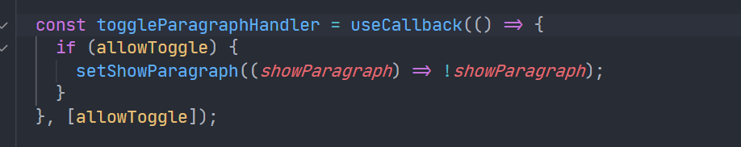

# React Behind the Scene

- How does React work behind the scenes?
- Understanding the virtual DOM & DOM Updates
- Understanding State & State Updates

## How does React work behind the scenes

- React does not know the web, it does know nothing about the browser in the end. React know how to work with components.
- ReactDom actually needs to bring real HTML elements to the screen.
- React is a library that manages components that manages state. React only cares about components.
- React determines how the component tree currently looks like and what it should look like.
- ReacDom receives the difference and then manipulates the real DOM to match the virtual DOM.
- Re-evaluating components does not mean re-rendering the DOM.
  - Re-evaluate whenever props, state or context changes.
  - React executes component functions
  - Changes to the real DOM are only made for differences between evaluations.
  - Making a virtual dom comparison (between current state n previous state) is fairly cheep and easy to do. While working with the real DOM is an expensive rendering task.
  - It does the virtual dom diffing. It will pin to the place where needed to change.
- Re-evaluation of parent component will always leads to re-evalation of child component. And of course, does mean that real dom is touched.

## Optimize the rendering process

- Introducing the `React.memo`, the component wrapped with `React.memo` will only be re-evaluated when the props changes.
- But it comes at a cost, it stores the previous component and compares the current component and determine if the re-evaluate the component.
- For those static components, use `React.memo` to avoid re-evaluation.
- For those high-level components, use `React.memo` will avoid multiple component re-evaluation, i.e. the whole sub tree will be blocked from the root-branch.
- Gotha: the `Button` in `react-optimization-project\...\Button.js` will be re-evaluated, because the `toggleParagraphHandler` hanlde function will be re-created in `App.js` the React will consider the new function different from previous function. While `false`, `123`, `'s'` are primitive values this react consider these values the same.
- To solve the above problem that React considers newly created handler function differently. We introduce `useCallback()` hooks, to store the handler function in RAM as object and will not always re-create it when rendering the `App` component.
- funtions are closures. \
  Bad Example
  

  Good Example
  

- Very important summary: `Section12: A Look Behind The Scenes Of React & Optimization Techniques/157. A First Summary`

### Managing states and components

- `useState(false)`, the `false` passed to `useState` is essentially only evaluated once. The very first the the component runs. As long as the component statys attched to the DOM, the `useState(false)` will not initialize the state function.
- `setStateFunc` runs will not immediately changes the state, instead, it scheduled a state change. In most of the time, scheduled state changes will be processed very fast.
- In React, it has its own set of rules for the priority of scheduled state updates. Like the `Priority Queue` data structure. The order of the state changes for the same type will not be changed(i.e. react consideres them the same priority and will order them as the orders pushed into the scheduling queue.). This is actually a safe way to update the state, ensuring that state changes are processed in order.
- Batch

  - If two state update functions are executed in the component(in a synchronous way, nothing in between will cause a time delay), this does not mean that the component will re-evaluate twice. React will batch those updates together.

- data memoizing: `useMemo`

  ```js
  // DemoList.js
  import {useMemo} from 'react';
  ...
  const DemoList = {props} => {
    const {items} = props;
    const sortedList = useMemo(() => {
      return items.sort((a,b) => a - b);
    }, [items]);
    ...
  }
  ...

  // App.js
  import {useMemo} from 'react';
  ...
  const listItems = useMemo(() => [5,3,1,10,9], []);
  return
  ...
    <DemoList title={listTitle} items={listItems}}/>
  ...
  ```

- memoizing function is more used than memoizing data.
