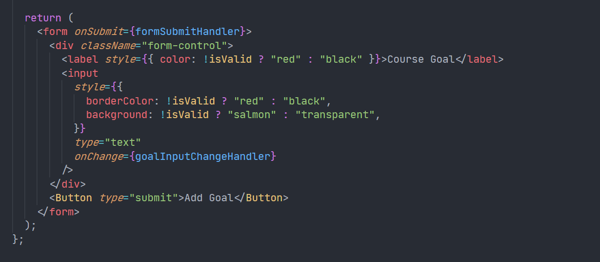
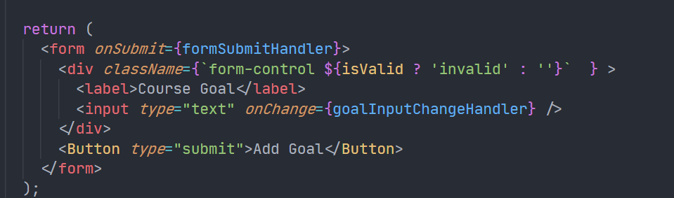
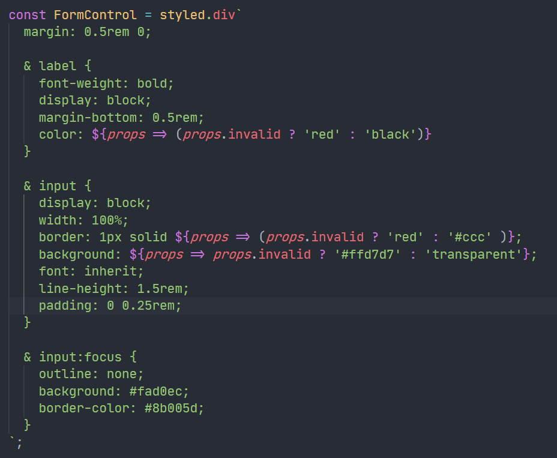

# Styling Components

- Conditional & Dynamic Styles
- Styled Components
- Css Modules

## Conditional & Dynamic Styles

- Tenary Expression in `style` for inline style

  ```js
  <label style={{ color: !isValid ? "red" : "black" }}>Course Goal</label>
  ```

- Inline style has very high priority in CSS. Not very satisfied.
  
- By adding dynamic class name, we avoid using inline style.
  

## Styled Components & CSS Modules

- If you import styles like this `import './CourseInput.css`, what you get is a non-scoped(i.e. global) styling. If all of the files doing this way, we may have naming conflict problems soon.
- Two approach to solve the above problem: [Styled Components](https://styled-components.com/) and CSS modules
- Styled Components is a package that helps you build components which have styles attached to them where the styles really only affect the components to which they were attached and not any other components.
- The following is called the tagged template literals, it's a default javascript feature, it's not specific to this package and it's not specific to react, you could use it in any Javascript project.
- `<button type={props.type} className="button" onClick={props.onClick}>` this `props.onClick` is not passed from parent component. Why? Built-in method?
- A fancy way to avoid using `className` and directly using className values

  ```js
  // traditional way, FormControl is styled component
  <FormControl className={!isValid ? 'invalid' : ''}>
  </FormControl>

  // fancy way
  <FormControl invalid={!isValid}>
  </FormControl>
  ```

  

  Note that here the whole file of `CourseInput.js` is re-rendered. Not just `const CourseInput = ..., export ...`

- CSS modules: First you should rename your css file from `Button.css` to `Button.module.css`.

  ```js
  import styles from "./Button.module.css";

  const Button = (props) => {
    return (
      <button
        type={props.type}
        className={styles.button}
        onClick={props.onClick}
      >
        {props.children}
      </button>
    );
  };
  ```

- In the case where it is invalid to write `styles.form-control` we can write `styles['form-control']` instead.

  ```js
  import styles from "./CourseInput.module.css";
  ...
  return (
    <form onSubmit={formSubmitHandler}>
      <div className={`${styles['form-control']} ${!isValid && styles.invalid}`}>
        <label>Course Goal</label>
        <input type="text" onChange={goalInputChangeHandler} />
      </div>
      ...
    </form>
  );
  ```

- When checking the real class names in the browser, we can find the two solutions `styled components` and `css modules` are different. The former looks like two random hash `sc-gsDJrp fMYwMg` the later is more informative `Button_button__2lgkF`, could be intepreted as the componentName_cssClassName\_\_randomHash.

- CSS modules has the advantage with scoping (css only has no such feature) and having css code and javascript code separately (styled components does not have such feature).
